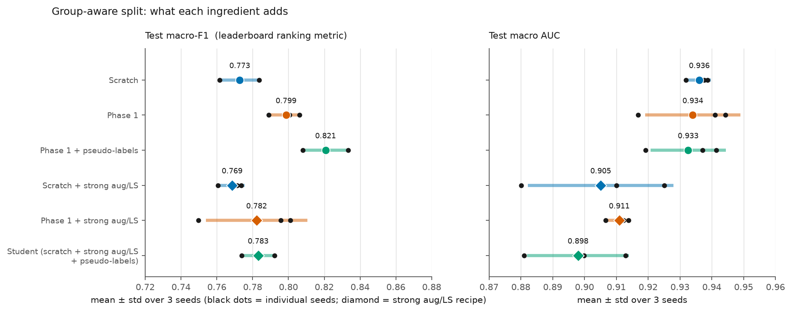
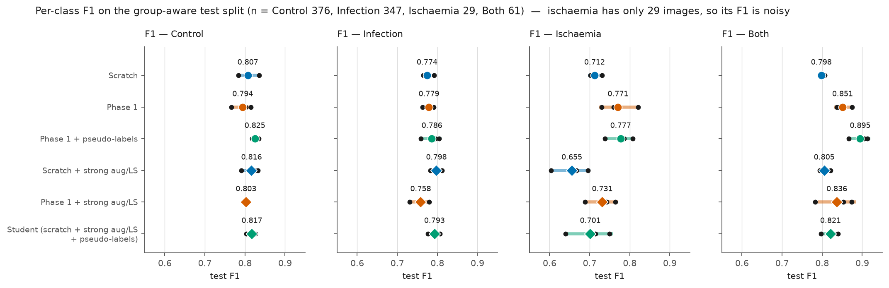
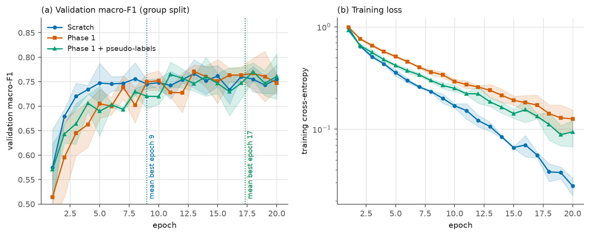
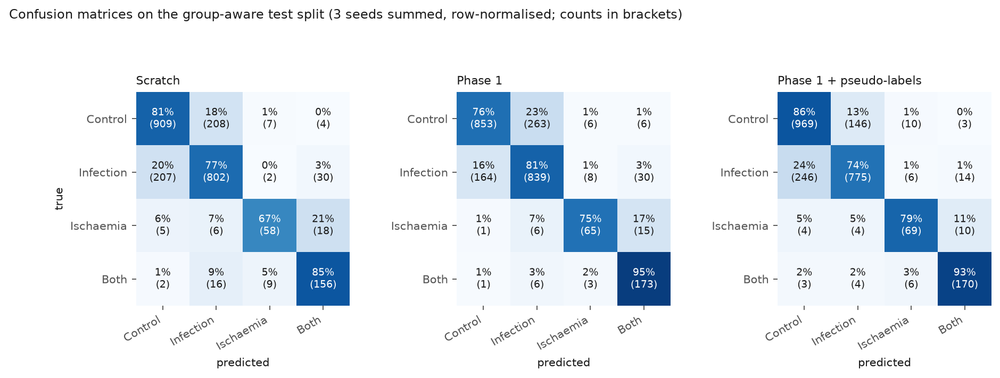
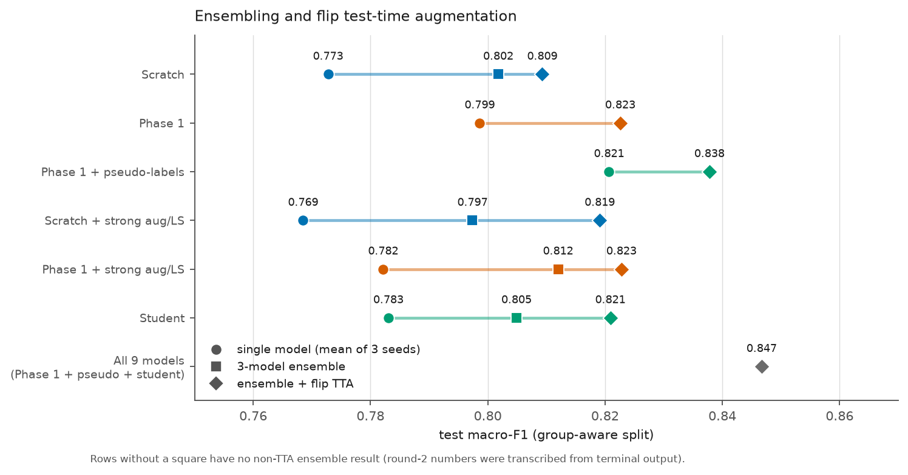
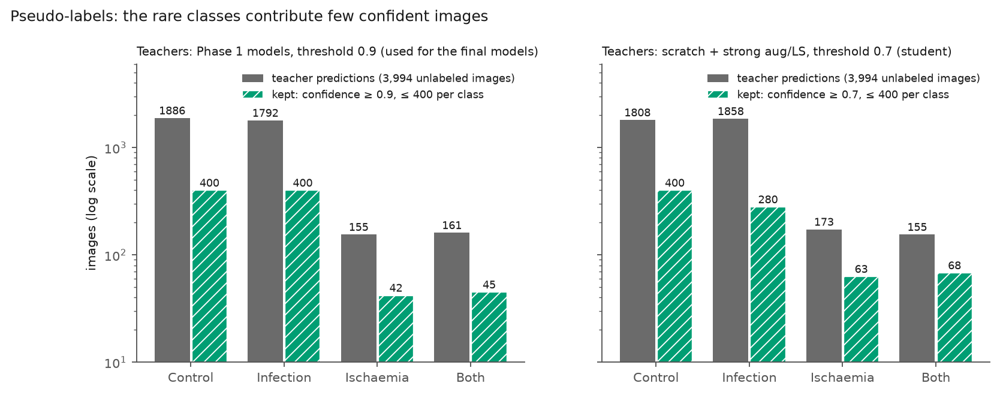

# Experiments

Chronological record of every experiment: **why** it was run, **how**, **what it showed**, and how
to read it. Method background is in [METHODS.md](METHODS.md); every table here is generated into
[results_tables.md](results_tables.md) by [`scripts/make_figures.py`](../scripts/make_figures.py)
from the committed `results/*.json`. Raw logs are in `logs/` (see [`logs/README.md`](../logs/README.md)).

| # | Experiment | Status | One-line result |
|---|---|---|---|
| E1 | Phase-1 SimMIM pre-training | done | reconstruction loss 0.393 → 0.096 over 100 epochs |
| E2 | Scratch vs Phase 1, **random** split | done | 0.880 vs 0.870 — no benefit (but see E3) |
| E3 | Leakage diagnosis → **group-aware** split | done | 22 % of test images have a near-duplicate; scores drop ≈ 0.1 |
| E4 | Ablation on the group-aware split (6 conditions × 3 seeds) | done | Phase 1 +0.026, + pseudo-labels +0.022, strong aug/LS no help |
| E5 | Ensembling and flip-TTA | done | +0.03 and +0.01–0.02 |
| E6 | Pseudo-labelling analysis | done | rare classes contribute few confident labels |
| E7 | Final models + predictions on the challenge test images | done | class mix shift visible; **not yet submitted** |
| E8 | Low-label study (10/25/50 % labels) | implemented, **not run** | — |
| E9 | More splits, other Phase-1 objectives | not started | — |

---

## E1 — Phase-1 pre-training (SimMIM)

**Why.** Generic DINOv2 features are not specialised to wound photographs. Masked-image modelling
on the 3,994 unlabeled images adapts the LoRA adapters to the domain without labels — the
"domain-adaptive" part of the project.

**Setup.** 60 % patch masking, L1 loss on masked patches, LoRA (rank 16) + light linear decoder,
100 epochs, batch 32 ([`src/pretrain.py`](../src/pretrain.py)).


**Result.** Loss falls quickly (0.393 → 0.15 in 6 epochs) and then slowly (0.111 at epoch 30, 0.096
at epoch 100). It was still decreasing at 100 epochs, so more pre-training is possible.

**Reading.** A low reconstruction loss only shows the adapters learned to rebuild masked pixels;
whether that helps *classification* is tested in E2/E4. Log: `logs/run_all.log` (first 100 lines).

---

## E2 — Scratch vs Phase 1 on a random split

**Why.** The core hypothesis: initialising LoRA from Phase 1 should beat a fresh start.

**Setup.** Stratified random 70/15/15 split (4,167 / 894 / 894), 30 epochs, fp32, inverse-frequency
class weights, seeds 0–2, paired by seed.

| Test metric (3 seeds) | Scratch | Phase 1 |
|---|---|---|
| Macro-F1 | **0.880 ± 0.017** (0.898, 0.866, 0.877) | **0.870 ± 0.010** (0.859, 0.874, 0.876) |
| F1 Control / Infection | 0.879 / 0.868 | 0.849 / 0.843 |
| F1 Ischaemia / Both | 0.860 / 0.914 | 0.875 / 0.912 |

Paired difference (Phase 1 − scratch): −0.040, +0.009, −0.000 (mean −0.011).

**Reading.** No benefit — the difference is smaller than the baseline's seed spread. But the
scores are far above the leaderboard (≈ 0.65), which prompted E3.

*Provenance note.* Early debug runs and the first 30-epoch run (`logs/full_run.log`) predate
v0.4.1: with older `peft` the Phase-1 weights were silently **not applied**, so the "pretrained"
arm there equalled scratch. The guard added in v0.4.1 caught it (`logs/run_all.log`, the
`RuntimeError`), and the pretrained results above come from the fixed code (`logs/run_rest.log`:
"48 LoRA tensors, 24 non-zero lora_B matrices"). The "+5 pp" debug-run claim in v0.3.0 was noise
on 20 images.

---

## E3 — Why were internal scores so high? Leakage and the group-aware split

**Why.** Leaderboard entries top out at ≈ 0.66 macro-F1 while this project scored 0.88, and train
accuracy reached 99 %. DFUC2021 provides no patient IDs, so near-duplicates of one ulcer may sit in
both train and test.

**Setup.** `python -m src.make_groups --auto`: DINOv2 embeddings → cosine-similarity clusters →
`groups.csv`; the diagnostic counts test images with a training neighbour (see
[METHODS.md §5](METHODS.md)). 3,925 groups; threshold 0.85 chosen automatically.


**Result.**
- (b) 22.3 % of random-split test images have a training image at cosine ≥ 0.90 (3.8 % at ≥ 0.95,
  0.1 % at ≥ 0.98); the group-aware split removes all of them.
- (a) The same models score lower on the leak-free split: scratch **0.880 → 0.773**, Phase 1
  **0.870 → 0.799** (different test sets: 894 vs 813 images, so approximate).

**Reading.** About 0.1 macro-F1 of the earlier numbers was leakage, and the leak was larger than
the exact-duplicate rate suggests: images of the same ulcer need not be near-identical to help a
model that over-fits (train accuracy ≈ 99 %). Every later decision uses the group-aware split. It
also reverses the E2 conclusion about Phase 1 (E4).

---

## E4 — Group-aware ablation: what does each ingredient add?

**Why.** With a trustworthy split, measure each design choice: Phase 1, pseudo-labels, and a
"regularisation for shift" recipe (strong augmentation + label smoothing).

**Setup.** One group-aware split (seed 0; 4,332 / 810 / 813), 20 epochs, bf16 + TF32, class weights,
three seeds per condition (`scripts/run_all_experiments.sh`, 43 min in total):

| Condition | Initialisation | Augmentation / loss | Training data |
|---|---|---|---|
| Scratch | fresh LoRA | basic | 4,332 labeled |
| Phase 1 | Phase-1 LoRA | basic | 4,332 |
| Phase 1 + pseudo-labels | Phase-1 LoRA | basic | 4,332 + 887 pseudo (teachers: Phase 1, threshold 0.9) |
| Scratch + strong aug/LS | fresh | strong crops/rotation/colour, label smoothing 0.1 | 4,332 |
| Phase 1 + strong aug/LS | Phase-1 LoRA | strong, LS 0.1 | 4,332 |
| Student | fresh | strong, LS 0.1 | 4,332 + 811 pseudo (teachers: scratch + strong/LS, threshold 0.7) |



| Condition | Macro-F1 | Last-epoch F1 | Macro AUC | F1 Ctrl | F1 Inf | F1 Isch | F1 Both |
|---|---|---|---|---|---|---|---|
| Scratch | 0.773 ± 0.011 | 0.780 | 0.936 | 0.807 | 0.774 | 0.712 | 0.798 |
| Phase 1 | 0.799 ± 0.009 | 0.783 | 0.934 | 0.794 | 0.779 | 0.771 | 0.851 |
| **Phase 1 + pseudo-labels** | **0.821 ± 0.013** | 0.810 | 0.933 | 0.825 | 0.786 | 0.777 | 0.895 |
| Scratch + strong aug/LS | 0.769 ± 0.007 | 0.769 | 0.905 | 0.816 | 0.798 | 0.655 | 0.805 |
| Phase 1 + strong aug/LS | 0.782 ± 0.028 | 0.748 | 0.911 | 0.803 | 0.758 | 0.731 | 0.836 |
| Student (pseudo, scratch) | 0.783 ± 0.009 | 0.781 | 0.898 | 0.817 | 0.793 | 0.701 | 0.821 |

**Paired differences (same seed index).**
- Phase 1 − scratch: +0.028, +0.027, +0.023 (mean **+0.026**, 3/3); last-epoch mean +0.004.
- Phase 1 + pseudo − Phase 1: +0.007, +0.032, +0.027 (mean **+0.022**, 3/3); last-epoch +0.027.
- Phase 1 − scratch under strong aug/LS: −0.022, +0.035, +0.027 (mean +0.014, 2/3); last-epoch −0.021.
- Student − scratch + strong aug/LS: +0.012, +0.013, +0.018 (mean **+0.014**, 3/3).







**Reading.**
1. **Phase 1 helps modestly.** The gain is ≈ 2.5× the seed spread, consistent in all three seeds,
   and concentrated in the rare classes (ischaemia +0.06, both +0.05 F1; but ischaemia has 29 test
   images). It is smaller on the last-epoch model, so Phase 1 mostly improves the best point reached
   (Phase-1 models peak at epochs 16–19, scratch at 5–14 — the curves show Phase-1 models fit the
   training set more slowly: training loss 0.13 vs 0.03 at epoch 20, i.e. less over-fitting).
2. **Pseudo-labels add a further gain**, again in 3/3 seeds, mostly Control and "both" F1. Their
   effect on the rare classes is limited (E6).
3. **Strong augmentation + label smoothing hurt**: macro-AUC −0.03 and ischaemia F1 −0.06 for
   scratch; it also destabilised Phase-1 training (last-epoch F1 0.748 ± 0.047). We did not separate
   the two ingredients, so it is unknown which causes the drop.
4. **The dominant error is Control ↔ Infection confusion** in every condition (13–24 % of each
   class is mislabelled as the other), visible in the confusion matrices; ischaemia is mostly
   confused with "both" (11–21 %).
5. Macro AUC (0.90–0.94) is much higher than macro-F1 (0.77–0.82): the models rank images well; the
   hard decisions are the weak point.

---

## E5 — Ensembling and flip test-time augmentation

**Why.** Cheap models make ensembles affordable; averaging reduces seed variance, and flip-TTA
reduces sensitivity to orientation (ulcer photographs have no canonical orientation).

**Setup.** Average softmax over the three seeds of a condition (`src.predict --split test`), with and
without 4-view flip TTA, on the same group-aware test split (valid because all members share the
split and never saw its test labels).



| Set | Single (mean) | Ensemble | + flip TTA | Macro AUC (TTA) |
|---|---|---|---|---|
| Scratch | 0.773 | 0.802 | 0.809 | 0.950 |
| Phase 1 | 0.799 | — | 0.823 | 0.951 |
| Phase 1 + pseudo-labels | 0.821 | — | **0.838** | 0.945 |
| Scratch + strong aug/LS | 0.769 | 0.797 | 0.819 | 0.927 |
| Phase 1 + strong aug/LS | 0.782 | 0.812 | 0.823 | 0.921 |
| Student | 0.783 | 0.805 | 0.821 | 0.928 |
| All 9 (Phase 1 + pseudo + student) | — | — | **0.847** | 0.937 |

("—": not computed; the Phase 1, Phase 1 + pseudo and all-9 rows were run later and only the TTA
numbers were transcribed from the terminal into `results/ensemble_round2.csv`.)

**Reading.** A 3-model ensemble adds ≈ +0.03 macro-F1 and TTA another +0.007–0.022. These are the
most reliable gains. The best sets are close (0.838 vs 0.847); with 813 test images and 29
ischaemia images, that difference is within noise, and the three sets were picked after seeing test
scores, so treat the exact ranking cautiously.

---

## E6 — Pseudo-label analysis



The teachers' predictions on the 3,994 unlabeled images are dominated by Control and Infection
(≈ 1,800 each) with only ≈ 155–173 ischaemia and ≈ 155–161 "both" predictions. After the confidence
filter and the 400-per-class cap, **887** (Phase-1 teachers, threshold 0.9: 400 / 400 / 42 / 45) and
**811** (scratch + strong/LS teachers, threshold 0.7: 400 / 280 / 63 / 68) images remain.

**Reading.** Most pseudo-labels are for the two big classes, so the gain from E4 probably comes
from extra common-class data and regularisation rather than from help on the rare classes
(ischaemia F1 moved only 0.771 → 0.777). A lower threshold or per-class thresholds could add more
rare-class labels. Caveat: the unlabeled pool is not covered by `groups.csv`, so near-duplicates of
held-out test images may enter training with *pseudo* (never true) labels, which could make the
pseudo-label gain slightly optimistic. The hidden challenge test set would not benefit from this.

---

## E7 — Final models and predictions on the challenge test images

**Why.** Produce submission candidates and look at the real distribution shift.

**Setup.** Three final models: Phase-1 initialisation, basic augmentation, all 5,955 labels + 887
pseudo-labels (6,842 images), 20 epochs, seeds 0–2 (≈ 10 min each with three running together).
Predictions on the 5,734 challenge test images with flip TTA, also for the nine group-split models.


| Share of images (%) | Control | Infection | Ischaemia | Both |
|---|---|---|---|---|
| Training labels | 43 | 43 | 4 | 10 |
| Group-split test (true) | 46 | 43 | 4 | 8 |
| Challenge test, 9 group-split models | 55 | 29 | 8 | 7 |
| Challenge test, 3 final models | 49 | 34 | 10 | 8 |

The two prediction sets agree on 4,966 of 5,734 images (86.6 %). Mean top-class confidence is
0.84 (final models) vs 0.74 (group-split models; three of those use label smoothing, which lowers
confidence by design, so the gap is not evidence of shift).

**Reading.** On held-out *training* data the models predict ≈ 3 % ischaemia and ≈ 41 % infection
(estimated from the ensembles' precision and recall), close to the truth (4 % and 43 %); on the challenge test images they predict 8–10 % and 29–34 %. Since the same
models are well-behaved on held-out training data, this suggests that the challenge set really has
a different class mix (more ischaemia, fewer infections) or looks different enough to move the
predictions. It is an inference; the leaderboard score (not yet obtained) will test it. The
submission CSVs are in `artifacts/` (`sub_final*.csv`, `sub_groupmodels*.csv`).

---

## E8 — Low-label study (not run)

**Why.** Domain adaptation is usually motivated by label scarcity: Phase 1 might help more when
only 10–50 % of the labels are available.

**Status.** Implemented (`--train_frac`, `scripts/run_lowlabel.sh`), **no results yet** (the
available compute window was used for E4–E7). Planned protocol: 10 / 25 / 50 % of the training
labels (class-stratified, identical subset for both arms), epochs 100 / 60 / 40, group-aware split,
three seeds; read as a label-efficiency curve (`python -m src.summarize` writes
`results/label_efficiency.png`).

## E9 — Ideas not yet tested

- Repeat E4 on two more group-aware splits (`--split_seed 1, 2`) to measure split variance.
- Phase-1 variants: reconstruct DINOv2 patch *features* instead of pixels, lower mask ratio, higher
  LoRA rank, longer training or extra unlabeled images (`--extra_img_dirs`).
- Separate strong augmentation from label smoothing; per-class pseudo-label thresholds.
- Class-prior or threshold adjustment for the shifted test mix (check challenge rules first).
- Higher resolution (`--img_size 448`) and a larger backbone.

---

## Limitations and threats to validity

- **One fixed split**; seeds only vary initialisation, so split-to-split variance is unmeasured.
- **Small rare classes**: 29 ischaemia / 61 "both" test images; one image ≈ 3 recall points.
- **Group-aware ≠ patient-level**: groups are inferred from image similarity, not patient IDs.
- **Selection on test**: ensemble sets were compared on the test split; best-epoch selection uses the
  validation split of the same data.
- **Pseudo-label pool not group-checked** (see E6).
- **No leaderboard result** yet; the hidden test set is shifted, so internal scores overstate
  performance (E3, E7).
- **Mixed numerics**: the random-split runs used fp32 / 30 epochs; the group-aware suite used bf16 +
  TF32 / 20 epochs. Conditions inside each group are compared like for like.

## Reproducing

```bash
python -m src.make_groups --auto                      # groups.csv + leak diagnostic
bash scripts/run_all_experiments.sh                   # E4, E5, pseudo-labels, summary (~45 min on an L40S)
python -m src.predict --checkpoints checkpoints/g_pre_basic_s*_best.pt \
    checkpoints/g_pre_pseudo_s*_best.pt checkpoints/g_student_s*_best.pt \
    --split test --split_seed 0 --group_csv groups.csv --tta        # 9-model ensemble
python -m src.train --final --seed 0 --epochs 20 --batch_size 32 --imbalance weights --amp \
    --pretrained_lora_path checkpoints/dfu_pretrained_backbone.pt \
    --pseudo_csv pseudo_pre_probs.csv --pseudo_thresh 0.9 --pseudo_max_per_class 400 \
    --run_name final_pre_pseudo_s0                                  # a final model
python scripts/make_figures.py                        # regenerate every figure and table
```

The teacher step for the final models was
`python -m src.predict --checkpoints checkpoints/g_pre_basic_s{0,1,2}_best.pt --unlabeled_train --tta --out pseudo_pre.csv`.
