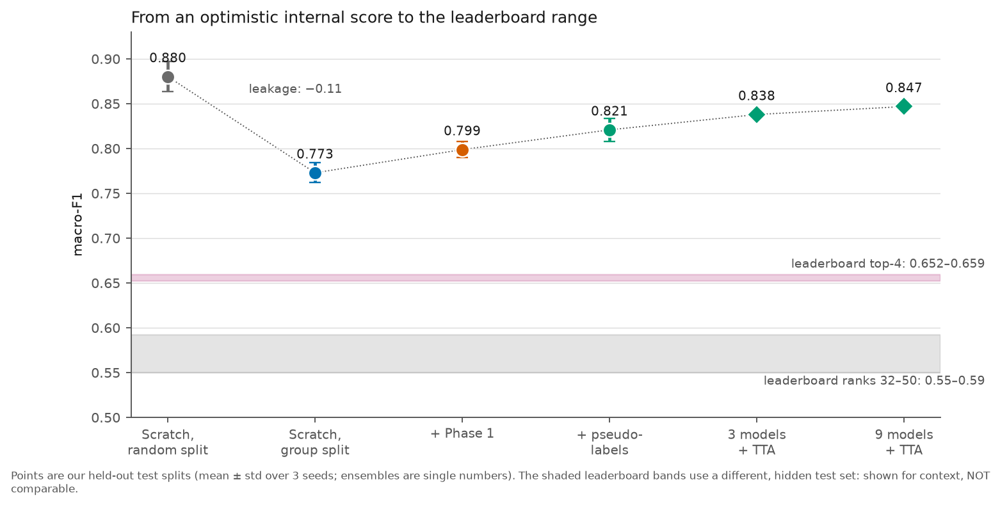
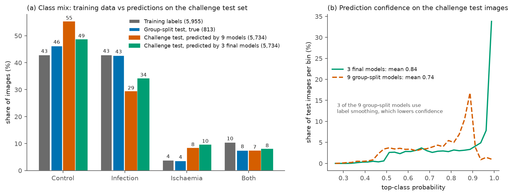

# DFUC2021 leaderboard: metrics, position, expectations

The DFUC2021 *open* (testing-set) leaderboard ranks submissions by **macro-F1** over the four
classes. This page records the reference scores, where this project stands, and what can honestly
be expected. **No submission has been made yet**; nothing here is a measured leaderboard result.

## 1. Reference scores (live leaderboard snapshot)

| Rank / user | Macro-F1 | Control | Infection | Ischaemia | Both | Macro prec. | Macro recall | Macro AUC | Micro F1 | Micro AUC |
|---|---|---|---|---|---|---|---|---|---|---|
| 1 Mahamudul_Hasan | **0.6592** | 0.7594 | 0.7145 | 0.5996 | 0.5634 | 0.6652 | 0.6593 | 0.8945 | 0.7172 | 0.9165 |
| 2 mdzh10 (Team_Sagittarius) | 0.6537 | 0.7570 | 0.6898 | 0.5843 | 0.5836 | 0.6697 | 0.6433 | 0.8902 | 0.7063 | 0.9111 |
| 3 iftekhar.ahmed (Team_Sagittarius) | 0.6534 | 0.7456 | 0.6484 | 0.6278 | 0.5919 | 0.6488 | 0.6874 | 0.8910 | 0.6855 | 0.9075 |
| 4 ffyytt (DFU-MORIS) | 0.6517 | 0.7709 | 0.6424 | 0.6118 | 0.5817 | 0.6520 | 0.6863 | 0.8698 | 0.6926 | 0.8989 |
| 32 sayefshahriar | 0.5923 | 0.6816 | 0.6865 | 0.5067 | 0.4945 | 0.6175 | 0.5795 | 0.8686 | 0.6613 | 0.8967 |
| 39 mohid | 0.5817 | 0.7371 | 0.6031 | 0.5088 | 0.4778 | 0.5821 | 0.6086 | 0.8257 | 0.6478 | 0.8483 |
| 49 d4mz | 0.5507 | 0.7324 | 0.6011 | 0.4397 | 0.4294 | 0.5579 | 0.5983 | 0.8596 | 0.6382 | 0.8783 |
| **this project** | *not yet submitted* | | | | | | | | | |

Top-4 ranges: macro-F1 **0.652–0.659** (spread 0.008), Control F1 0.746–0.771, Infection 0.642–0.715,
Ischaemia 0.584–0.628, Both 0.563–0.592, macro AUC 0.870–0.895. Ranks ≈ 32–50: macro-F1 0.55–0.59.

## 2. What the numbers say

- **Hard task:** even the best entries reach ≈ 0.66 macro-F1 and ≈ 0.72 micro-F1.
- **Rare classes decide the ranking:** Control F1 is similar everywhere (0.73–0.77); ischaemia and
  "both" (0.43–0.63) are where entries differ.
- **AUC ≫ F1:** macro AUC ≈ 0.87–0.89 vs macro-F1 ≈ 0.65 — ranking quality is decent but the hard
  decisions are off, consistent with a class-mix / calibration shift between training and test.

## 3. Where this project stands

Internal, leak-free (group-aware) results — **a different, non-hidden test set, so not comparable**:

| Setup | Macro-F1 | Macro AUC | F1: Ctrl / Inf / Isch / Both |
|---|---|---|---|
| Scratch (single model, mean of 3) | 0.773 | 0.936 | 0.807 / 0.774 / 0.712 / 0.798 |
| Phase 1 | 0.799 | 0.934 | 0.794 / 0.779 / 0.771 / 0.851 |
| Phase 1 + pseudo-labels | 0.821 | 0.933 | 0.825 / 0.786 / 0.777 / 0.895 |
| 3-model ensemble + TTA (Phase 1 + pseudo) | 0.838 | 0.945 | — |
| 9-model ensemble + TTA | 0.847 | 0.937 | — |

The gap between these (0.77–0.85) and the leaderboard (0.55–0.66) is mostly **distribution shift** to the
hidden test set: the random-split → group-split drop explains ≈ 0.1, the rest cannot be measured on
training data. The shift is visible in the predictions on the real test images:

On held-out training data the models predict ≈ 3 % ischaemia and ≈ 41 % infection; on the 5,734
challenge images they predict 8–10 % and 29–34 %, so the challenge set probably has a different class
mix (or looks different enough to move the decisions). Two prediction sets from different model
groups agree on 86.6 % of images.

## 4. How the approach differs and why it may help

| Aspect | Typical supervised entry (as far as I know) | This project |
|---|---|---|
| Backbone | ImageNet CNN/ViT fully fine-tuned, often an ensemble | Frozen DINOv2 ViT-B/14 + LoRA (0.68 % trainable); ensemble of ≈ 5-minute models |
| Unlabeled data (3,994) | often unused, or pseudo-labelling | SimMIM domain adaptation **and** pseudo-labelling |
| Loss | cross-entropy (+ weights / focal) | CE + supervised contrastive on [CLS] + class weights |
| Validation | random hold-out / k-fold | group-aware split against near-duplicate leakage |
| Inference | TTA + ensemble | flip TTA + ensemble |

Measured contribution of each part (leak-free split): Phase 1 **+0.026**, pseudo-labels **+0.022**,
ensembling **+0.03**, TTA **+0.01–0.02**; strong augmentation + label smoothing **−** (AUC −0.03).
These are modest, individually near the seed noise (±0.01), but consistent across seeds.

## 5. Honest expectations

These are planning estimates, not results:

- **Leaderboard, this recipe:** the internal gains are a few points each; whether they transfer under
  shift is unknown. A mid-table score (≈ 0.55–0.62 macro-F1) is plausible; the top-4 are separated by
  < 0.01, so reaching ≥ 0.65 would need a further ≈ +0.05 beyond the internal gains and is a stretch goal.
- **What would raise confidence:** the leaderboard row of the first submission — it shows whether the
  gap is mostly shift (all classes low), class mix (ischaemia/infection F1 off) or calibration (AUC
  fine, F1 low).
- **Watch these columns:** macro-F1 ≥ 0.65, ischaemia F1 ≥ 0.58, both F1 ≥ 0.56, macro AUC ≥ 0.89.

## 6. Submission workflow

1. Settings were chosen on the **group-aware** split (E4 in [EXPERIMENTS.md](EXPERIMENTS.md)).
2. Final models: `python -m src.train --final ...` on all labeled images + pseudo-labels (3 seeds).
3. Predict the challenge images with ensemble + TTA:
   `python -m src.predict --checkpoints checkpoints/final_pre_pseudo_s*_final.pt --img_dir <test_images> --tta --out sub_final.csv`
   → `sub_final.csv` (one-hot labels) and `sub_final_probs.csv` (probabilities). Candidate files are in
   [`artifacts/`](../artifacts/README.md).
4. **Check the submission format first.** The leaderboard reports AUC, so it probably wants
   probabilities (`*_probs.csv`); AUC computed from hard labels is much lower. If the page shows 0/1
   values, submit the one-hot file.
5. After submitting, log the score next to the group-split score; if they track each other the
   evaluation is trustworthy.

## 7. Rules and risks

- Check the rules on pre-trained weights (DINOv2), pseudo-labelling, and any use of unlabeled test
  images (e.g. class-prior adjustment or Phase-1 adaptation on them) before relying on them.
- Do not tune on the leaderboard; use it as a sparse check of shift.
- DFUC2020 (as far as I recall, ulcer bounding boxes for detection) cannot train the 4-class head; at
  most it can add unlabeled images to Phase 1 (`--extra_img_dirs`). DFUC2022 (segmentation, Dice) is a
  different task and would need masks and a segmentation head.
