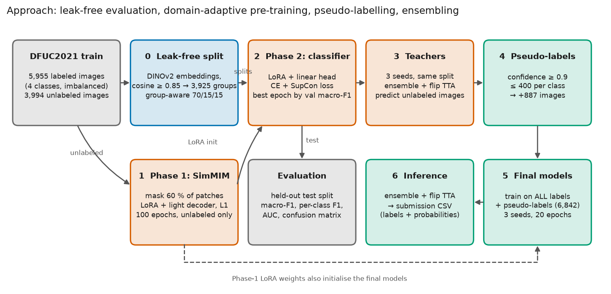
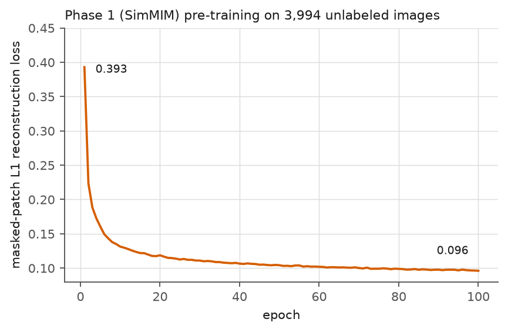
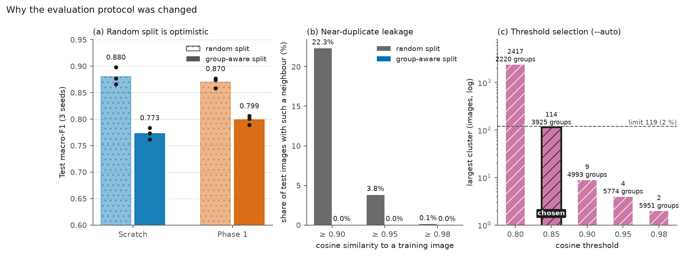

# Methods

What every component is, why it is there, and the exact settings used. Results are in
[EXPERIMENTS.md](EXPERIMENTS.md).

## 1. Data

| | Images | Notes |
|---|---|---|
| DFUC2021 train, labeled | 5,955 | `none` ≈ 43 %, `infection` ≈ 43 %, `ischaemia` ≈ 4 %, `both` ≈ 10 % |
| DFUC2021 train, unlabeled | 3,994 | no labels in `train.csv` (rows 5,956 – 9,949) |
| Challenge test | 5,734 | labels hidden; scored on the DFUC2021 leaderboard |

`train.csv` is one-hot (`none, infection, ischaemia, both`). There are **no patient IDs**.
Images are resized to 224 × 224 and normalised with ImageNet statistics.

## 2. Model

**DINOv2 ViT-B/14** (`facebook/dinov2-base`, ≈ 87 M parameters including the adapters) is a self-supervised vision
transformer that gives strong general-purpose features. It is kept **frozen**.

**LoRA** (low-rank adaptation) adds small trainable matrices to the attention *query* and
*value* projections of every transformer block (rank 16, α 32, dropout 0.1). Only
**589,824 parameters (0.68 %)** are trained — plus a linear head (LayerNorm + Linear 768 → 4) in
Phase 2 or a light pixel decoder in Phase 1. Consequences: little capacity to over-fit,
small checkpoints (a few MB), and ≈ 5 minutes per model on an L40S GPU.

## 3. Phase 1 — domain-adaptive pre-training (SimMIM)

*Why:* adapt the generic features to DFU photographs (skin, wound textures, lighting) without
using any labels, so the 3,994 unlabeled images contribute.

*How:* masked image modelling in the SimMIM style. 60 % of the 14 × 14 patches are zeroed at the
pixel level, the LoRA-adapted encoder processes the corrupted image, and a LayerNorm + Linear
decoder (453,708 parameters) reconstructs the pixels of the masked patches. Loss: L1 on masked
patches only. 100 epochs, batch 32, AdamW (lr 1e-4, weight decay 1e-2); loss 0.393 → 0.096.
The resulting LoRA weights initialise the Phase-2 models.

## 4. Phase 2 — supervised classification

Loss = 0.5 × cross-entropy + 0.5 × **supervised contrastive** (SupCon) on the L2-normalised [CLS]
embedding. SupCon pulls embeddings of the same class together and pushes different classes apart,
which is meant to help rare classes. Cross-entropy uses **inverse-frequency class weights**
(`--imbalance weights`) to counter the imbalance. Optimiser AdamW (lr 1e-4, weight decay 1e-2),
batch 32, 20 epochs, bf16 autocast + TF32. Augmentation: flips and mild brightness/contrast
jitter (`--aug basic`). The best epoch is chosen on **validation macro-F1** and evaluated once on
the held-out test split. The last-epoch model is also evaluated (needs no validation labels).

## 5. Leak-free evaluation protocol

*Problem:* DFUC2021 has no patient IDs, so near-identical images of one ulcer can land in both
train and test under a random split.

*Fix* ([`src/make_groups.py`](../src/make_groups.py)): embed every labeled image with frozen
DINOv2, link pairs whose cosine similarity is ≥ a threshold, and take connected components as
**groups**. `--auto` picks the lowest threshold from {0.80, 0.85, 0.90, 0.95, 0.98} whose
largest cluster is ≤ 2 % of the images (0.80 produced one giant 2,417-image cluster).
With threshold 0.85: **3,925 groups** (2,860 singletons, 572 pairs, 422 triples, …, largest 114).
Splits are then made with `StratifiedGroupKFold`: **70 / 15 / 15 train / val / test**
(4,332 / 810 / 813 images; test = 376 none, 347 infection, 29 ischaemia, 61 both), class-stratified,
deterministic in `--split_seed`. All reported group-split results share split seed 0; replicates
differ only in `--seed` (initialisation / data order).

The diagnostic printed by `make_groups` shows the share of test images with a training neighbour:

| cosine ≥ | 0.90 | 0.95 | 0.98 |
|---|---|---|---|
| random split | 22.3 % | 3.8 % | 0.1 % |
| group-aware split | 0 % | 0 % | 0 % |

There is no exact-duplicate leakage (0.1 % at 0.98), but about a fifth of test images have a very
similar training image (same patient/ulcer, different shot).

## 6. Pseudo-labelling (noisy student)

*Why:* use the 3,994 unlabeled images for supervised training too.

1. Three teachers (same split, different seeds) predict the unlabeled images; probabilities are
   averaged over the ensemble and 4 flip views.
2. Predictions with confidence ≥ a threshold are kept, at most 400 per class so the big classes do
   not swamp the rare ones (`--pseudo_thresh`, `--pseudo_max_per_class`).
3. A student is trained on labeled + pseudo-labeled images.

Teachers never see the student's validation/test labels (same split). Confidence thresholds depend
on the recipe: teachers trained with label smoothing 0.1 cannot exceed ≈ 0.925 confidence, so 0.7
was used for them and 0.9 for teachers without label smoothing.

## 7. Ensembling and test-time augmentation

Softmax probabilities are averaged over models (`src.predict`), and over the identity and
horizontal / vertical / both flips (**TTA**). This reduces variance and is cheap with ≈ 5-minute
models.

## 8. Final models and submission files

`--final` trains on **all 5,955 labeled images** (no holdout) for a fixed 20 epochs and saves the
last-epoch LoRA + head weights. The final recipe: Phase-1 initialisation, basic augmentation,
+ 887 pseudo-labels from three Phase-1 teachers (6,842 training images), 3 seeds.
`src.predict` writes a one-hot CSV (`image,none,infection,ischaemia,both`, same layout as
`train.csv`) and a `*_probs.csv` with the averaged probabilities.

## 9. Metrics

Reported exactly like the leaderboard columns:

- **Macro-F1** — mean of the four per-class F1 scores (each class counts equally, so rare classes
  matter as much as common ones). The ranking metric.
- **Per-class F1** (Control / Infection / Ischaemia / Both) — harmonic mean of precision and recall.
- **Macro / micro AUC** — one-vs-rest area under the ROC curve from the class probabilities
  (needs probabilities, not labels).
- **Accuracy / balanced accuracy**, **confusion matrix**, **precision / recall** per class.

Per-class metrics on ischaemia rest on 29 test images (one image ≈ 3 recall points), so they are
noisy; macro-F1 over 3 seeds is the primary comparison.

## 10. Compute and settings

| | |
|---|---|
| GPU | NVIDIA L40S, 46 GB (one) |
| Precision | bf16 autocast + TF32 (Phase-2 runs of the group-aware suite); earlier random-split runs used fp32 |
| Throughput | 20-epoch run ≈ 4.7–5.3 min with two jobs sharing the GPU; 3 concurrent runs with pseudo-labels 8–10 min |
| Phase 1 | 100 epochs × ≈ 17 s ≈ 28 min |
| Whole experiment suite | 43 min (`scripts/run_all_experiments.sh`), no job skipped or failed |
| Seeds | 0, 1, 2 for every condition; split seed 0 |

Everything is reproducible from the committed scripts; settings of every run are stored in the
`config` field of `results/<run>.json`.
